<link rel="stylesheet" href="style.css">

# Урок 1. Игровая

### Приветствую тебя вновь, мой дорогой воспитанник!

В сегодняшнем уроке мы ознакомимся с «сердцем» игры «CatWar» — Игровой. Мы подробно разберём игровое поле, его разделы. Ты поподробнее узнаешь про активность, её виды и способы прокачки, а также узнаешь о лагере Грозового племени.

Начнём! Навостри ушки и слушай внимательно.

---

# Игровая и её составляющие

**Игровая** — это то место, где и происходит основная игра. Переход в неё доступен после выбора окраса в «Конструкторе окрасов» и прочтения племенной «Памятки» от Старейшины (надеюсь, ты её уже прочитал и запомнил). Кнопка для перехода в Игровую находится посередине кнопок разделов сайта между кнопочками «Чат» и «Личные Сообщения». Просто нажми на неё!

В зависимости от выбранного тобой дизайна название кнопки, ведущей в Игровую, может варьироваться: где-то это может быть просто «Игровая», а где-то для красоты заменено на «Играть». В редких случаях эта кнопка может быть представлена как какое-то красивое украшение (чаще всего это цветок или лапка).

Пример кнопки «Игровая»:

---

# Части Игровой

Игровая состоит из нескольких разделов: игрового поля, чата и нижнего раздела. Разберём каждый поподробнее.

## **Игровое поле**

Игровое поле находится по центру между чатом (сверху) и нижним разделом, который мы разберём чуть позже. Представляет собой небольшое поле размером 10 на 6 клеток. На ней стоит красочный фон, зависящий от локации, и находятся фигурки котов — других игроков.

Для того, чтобы узнать информацию про своего или чужого персонажа, нужно просто навести курсор мыши на его модельку: там ты увидишь его имя, должность, предметы во рту и запах (у каждого племени свой).

В Игровом поле происходят практически все действия игры. На нём можно перемещаться по локации, нажав на любую свободную клетку мышкой или тыкнув пальцем на экран (в зависимости от устройства, с которого ты играешь). Можно переходить и между локациями: для этого требуется нажать на переход на другую локацию (овал с названием локации и её уменьшенным фоном).

Так, чтобы пройти, например, в локацию «Скалистый Овраг», надо найти на локации, в которой я нахожусь, маленький переход на неё, и смело нажать на него — так я успешно перейду на другую локацию.

Передвигаться по локации можно как непосредственным нажатием мыши/тачпада/экрана телефона, так и при помощи **горячих клавиш** (доступны только на компьютерных устройствах). Это особенно полезно в активном бою или при передвижении на плавательных локациях.

**Список основных горячих клавиш:**

- W/Ц — вверх;
- A/Ф — влево;
- S/Ы — вниз;
- D/В — вправо;
- Q/Й — диагонально вверх-влево;
- E/У — диагонально вверх-вправо;
- Z/Я — диагонально вниз-влево;
- X/Ч — диагонально вниз вправо.

Со всеми горячими клавишами, доступными на сайте, ты можешь ознакомиться по [этой ссылке](https://catwar.net/about?id=3)**¹**.

***¹** — Если ссылка не открывается, попробуй заменить домен .net на .su (catwar.su).*

---

Над полем игровой отображаются доступные действия персонажа («Покопать землю», «Принюхаться», «Вылизаться» и так далее). Для того, чтобы выполнить какое-либо действие, надо просто нажать на иконку действия. Можно осуществлять действия как с собой, так и с другим игроком — для этого надо чуть правее основных действий найти «Действия с каким-либо котом в соседней клетке» и в списке чуть ниже выбрать любого понравившегося кота. После этого тебе автоматически будут доступны все действия с выбранным котиком. Чтобы вернуть действия с собой, надо в том же списке переключиться на «Действия с собой» или отойти от котика.

Также в игре есть «Специальные действия». Сейчас доступно только одно из них — «Широко открыть пасть». Оно позволяет забрать сразу все предметы на клетке (но не больше, чем поместится во рту).

Некоторые действия доступны всегда, некоторые — только при нахождении на определённой локации (например, «Плавать») или состоянию здоровья (при ранах нельзя копать), а другие можно выполнить при взаимодействии с другими котами. Действия чаще всего влияют на прокачку навыков, переход в боевой режим и поднятие процентов пары, которые позволяют завести своих котят.

Со всем списком действий, параметров и навыков мы подробнее ознакомимся в следующем уроке.

Под действиями расположены и другие иконки, такие как температура окружающей среды (ТОС), время дня, время года и небо, показывающее нынешнюю погоду. Температура и время года влияют на количество безопасных клеток на лазательных локациях (влияет и возраст игрока).

Для того, чтобы узнать «Кошачье время», нужно просто нажать на «Время дня» или «Время года». После нажатия ты перейдёшь на [раздел сайта](https://catwar.net/time) с «местным» временем. Отличие этого времени с реальным в том, что 1 игровая луна равняется 4 реальным дням².

² *— узнать количество лун определённого игрока ты можешь в его профиле; дата регистрации открывается при нажатии на кнопку с луной.*

Как выглядит сама Игровая:

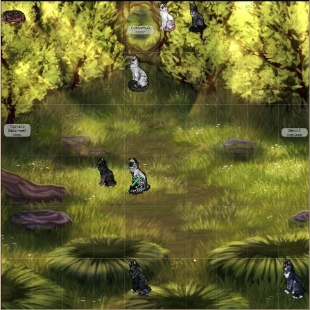

Помимо этого, на локации иногда встречаются **предметы**, которые можно поднять. Для этого следует только прыгнуть на клетку с предметом, и он появится у тебя во рту (если у тебя есть свободное место во рту). Некоторые предметы можно поднять только с определённого роста, который влияет на количество мест во рту (например, камни, которые могут занимать от одного до пяти мест во рту).

> Настоятельно прошу тебя спрашивать разрешение перед тем, как поднять какой-либо чужой предмет. Бери только свои предметы, бабочек, обычные ветки и игрушки на Полянке для Игр. Остальное могут счесть воровством — серьёзным нарушением правил племени, за которое тебя могут наказать.

Как предметы выглядят во рту:

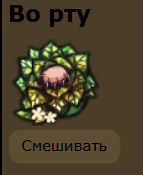

Фон зависит от выбранного дизайна.

---

## Чат

Над полем Игровой расположен такой важный отдел, как **чат Игровой**. Он состоит из нескольких частей:

1. Окна для ввода текста;
2. Кнопки «ОК», с помощью которой (или нажатием кнопки «Enter» на клавиатуре) можно отправлять сообщения;
3. Ползунка, который регулирует громкость (величину) слов (левее — тише, правее — громче³);
4. Реплик других котов;
5. Кнопок Х (пожаловаться на сообщение) и ➝ (перейти в профиль игрока).

³ — не стоит повышать голос без причины, старайся использовать среднюю громкость и ниже. Это является нарушением правил, за это могут наказать подстилками.

**Исключение:** выкрикивание имён на Собрании, нападение Барсука или вражески настроенных котов.

Сообщения в чате Игровой видно только на той локации, на которой находится кот (некоторые локации, например Скалистый овраг и Расщелина меж скал, имеют общий чат). Они сохраняются при переходе с локации на другую, но в случае обновления страницы стираются. К тому же, сообщения в чате хранятся только три минуты в случае обновления страницы при нахождении на той же локации.

> Не стоит флудить в чате, отправляя кучу бессмысленных сообщений. Во время сбора племенной деятельности (патрули, охота, дозоры) стоит проявлять уважение к собирающим и молчать; до и после сбора свободно общаться разрешается. Несоблюдение данных правил может помешать другим котикам, находящимся на локации.

Как выглядит чат в Игровой:

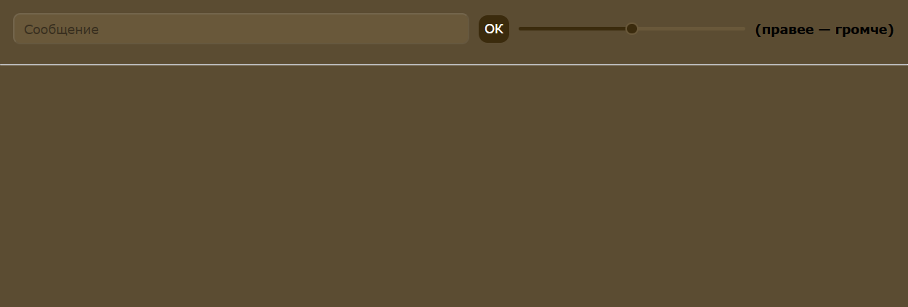

Фон зависит от выбранного дизайна.

---

## Нижний раздел

Находится под полем Игровой и включает в себя **родственные связи**, **историю**, **параметры** и **навыки**, а также **Тёмные баллы**.

*Родственные связи* показывают твоих самых близких родственников: маму, папу, братьев и сестёр и котят. Для того, чтобы увидеть расширенный круг родственников, ты можешь перейти по ссылке *«Генеалогический кустик»*, находящийся под РС. Помни, что *курсивом* отображаются приёмные родственники, а обычным текстом — родные.

*История* включает в себя твои последние действия как персонажа: переходы по локациям, взаимодействие с другими котиками, осуществление каких-либо действий. Её можно очистить, нажав на кнопку «Очистить историю», находящуюся под всей историей. Будь осторожен: история имеет свойство самоочищаться, если действий накопилось слишком много. Под историей ты так же можешь посмотреть своё текущее местоположение — название локации, на которой ты сейчас находишься.

> **Важно:** в некоторых ситуациях история предоставляется в качестве доказательства нарушений: нападение со стороны другого игрока, смешивание предметов, заход на запрещённую локацию, поимка нарушителя. Поэтому важно уметь делать качественные скриншоты в таких случаях.

*Параметры* и *навыки* мы разберём подробнее в следующих уроках. Все данные разделы можно скрыть и раскрыть вновь, нажав на заглавие.

В самом низу находится строка *«Тёмные баллы»* — это шанс персонажа попасть в Сумрачный Лес. Начисляются они при изгнании с помощью 7-дневнего лабиринта (4 ТБ), убийстве⁴/убийстве с применением укуса в горло (7 ТБ/14 ТБ). Чем меньше возраст персонажа и выше количество ТБ, тем выше шанс отправиться в Сумрачный Лес.

*Лог* всех полученных тобой *тёмных баллов* есть в профиле («Мой кот»/«Моя кошка»), под «О себе». Если ТБ отсутствуют, то там просто высветится надпись «Моя душа чиста!».

⁴ — убийством также будет считаться оставление котика с уровнем Плавательных или Лазательных Умений на локации, где уровень ПУ или ЛУ больше уровня навыков кота, тем самым подвергая его опасности погибнуть. Например, если ты вдруг выпустишь изо рта кота с 3 уровнем ПУ на локации «Водопад», уровень ПУ которого — 9, то тебе будут начислены 7 ТБ. Это не касается тех случаев, когда ты поднимаешь и опускаешь кота на одной и той же локации.

> **Повышать Тёмные Баллы не надо ни в коем случае.** Помни, что убийство в нашем племени позволяется только карателям (в их отсутствие — котам Школы Танцев) и в редчайших случаях самообороны.

> **Примечание:** за большое количество ТБ игрок может попасть в Сумрачный Лес (СЛ), в ином случае – в Звёздное Племя (ЗП). Подробнее можно почитать в разделе [Об игре](https://catwar.net/about?id=21).

Как выглядит нижняя часть Игровой:

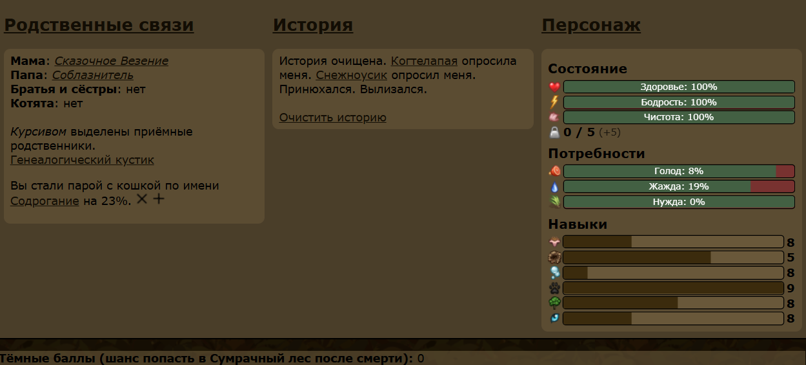

Фон зависит от выбранного дизайна.

---

## **Активность**

**Активность** — одна из самых важных характеристик в игре. Она влияет на скорость перехода, является основным требованием для посвящения в оруженосцы/воители или на вступление в различные отряды. Узнать свою активность можно в своём профиле или в разделе «Мой кот/Моя кошка».

Прокачивается активность с помощью перемещения по локациям, чей переход занимает больше 5 секунд (поэтому в номерных покачать активность не получится). Начальный переход новорождённого котёнка занимает 2 минуты, но со временем и количеством переходов он начинает уменьшаться до минимального перехода в 45 секунд («Легенда сайта»). Качать активность лучше с котячества, пока у тебя есть много свободного времени.

При понижении параметра здоровья переход также увеличивается и при критически низком его понижении может достигать часа или более.

#### Активность делится на обычную и недельную.

**Обычная активность** — это активность за всю жизнь персонажа, имеет названия активности и устоявшееся количество действий до следующего «уровня». Еженедельно понижается на 1 единицу. Если активность доходит до «Отрицательной» или ниже, то её можно аннулировать (5 раз за жизнь персонажа) — то есть, вернуть до «Переходной».

Недельная активность — активность за последние 7 дней. Увидеть её можно, нажав на иконку активности. Понижается только спустя неделю.

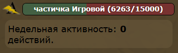

Узнать все названия активностей можно [здесь](https://catwar.net/about?id=6).

---

## **Лагерные локации**

Поговорим теперь об основных **локациях лагеря** нашего племени. Теперь ты точно будешь уверен в том, куда тебе можно ходить, а куда нельзя, а также узнаешь, что можно делать на той или иной локации, и для чего она вообще существует.

**Карты:**

- [Лагерь](https://i.ibb.co/2YWG36d2/image.png)
- [Детская](https://i.ibb.co/67yR760G/EgvZ.png)
- [Ежевичный Полог](https://i.ibb.co/qMZBDysY/image.png)

Карты также можно найти в [Памятке](https://catwar.net/ls?id=0), находящейся в одном из разделов Личных Сообщений, и в [Главном блоге](https://catwar.net/blog7185).

---

### Детская

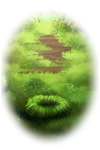

Именно здесь ты и появился на свет. В этой локации находится самое младшее звено нашего племени — котята, а также их мамы-королевы. Здесь часто проходит сбор на лекции или деятельность Искателей Грёз (в том числе и Время Забав, где Мастера играют с котятами или рассказывают сказки).

Посередине локации сидят два бота — [Удар Грома](https://i.ibb.co/BVx8d5b5/HAV7.png) и [Сверкающая Молния](https://i.ibb.co/zVtpK5Wr/HAV8.png). Удар Грома может с тобой поговорить и ответить на часто задаваемые вопросы, также именно от него воительницы могут надуться и завести котят (как родных, так и приёмных), если у них нет пары. Сверкающая Молния тоже может ответить на любой интересующий тебя вопрос.

В данной локации *можно* уходить из игры, но тебя все равно унесут в номерные локации, поэтому стоит засыпать в номерных. В них можно попасть из Детской, перейдя в *Зацветающий малинник* или в_Заросли ежевики._

Советую тебе прокачивать нюх именно в номерных палатках, потому что при уходе в оффлайн тебя могут поднять, вследствие чего действие собьётся, и тебе придётся выполнять его заново.

---

### **Светлые и Тёмные покои королев**

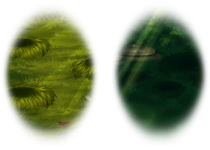

Здесь обитают королевы, у которых ты можешь попить молоко, если тебе меньше 3 лун, для того, чтобы утолить голод и жажду.

Выходить из игры **можно.**

---

### **Полянка для Игр (ПдИ)**

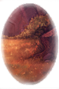

Лучшее место для того, чтобы скрасить свой досуг.

**Всего существует 3 ПдИ:** основная, верхняя (ВПдИ) и нижняя (НПдИ). Именно здесь мастера Искателей Грёз проводят свои игры и другую детскую племенную деятельность, а также читают сказки; лекторы зачитывают свои познавательные лекции.

Помимо этого, тут доступна охота на бабочек (по механике она идентична обычной, «взрослой» охоте), смешав которые можно получить игрушку «Стайка бабочек». Крафтится она следующим образом: обычная+красивая+редкая бабочка (подробнее здесь). Таким образом можно потренировать и свои охотничьи навыки, и получить красивую плюшку; существует также и активная охота на бота Красивая Бабочка, в процессе которой ты должен сбить боту энергию, после чего ты можешь получить бабочек или светлячков.

Уход в оффлайн запрещён карается подстилками.

Не рекомендую охотиться на бабочек и тренироваться с ботом с уровнем нюха и боевых умений соответственно ниже 4-5.

---

### **Скалистый овраг (СО; лагерь)**

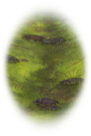

Сердце лагерных локаций.

Именно здесь осуществляется сбор племенной деятельности (патрули, дозоры и охота), созыв на Собрания племени и Совет. Во время Недели Звёздочек мастера Искателей Грёз могут созывать котяток в этой локации на всякую интересную котячью деятельность.

Чат лагеря объединён с чатом локации Расщелина меж Скал.

Выход из игры **разрешён** и подстилками не карается. Разговаривать во время сбора племенной деятельности **запрещается**, поскольку это сильно мешает собирающему.

---

### **Расщелина меж Скал (РмС)**

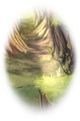

Является продолжением лагеря, соединённым чатом со Скалистым оврагом. Здесь часто проводятся грушевания — особый вид эффективных тренировок, про который ты узнаешь из следующего урока.

Засыпать здесь можно только на время восстановления параметра сна. В ином случае уход в оффлайн **запрещён** и карается подстилками.

---

### **Усеянный кувшинками прудик (УКП)**

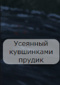

Является лагерной водной локацией, на которой можно безопасно прокачивать свои плавательные умения всем желающим. Имеет 0-1 уровень ПУ, поэтому утонуть на данной локации невозможно, можешь плавать сколько тебе будет угодно. Во время прокачки ПУ и нахождения на плавательной локации у тебя будет уменьшаться параметр сонливости.

Перейти в неё можно только из Расщелины меж Скал, на которой и можно отоспаться после купания.

Засыпать здесь **нежелательно**: наказания не будет, но тебя могут унести в номерные.

---

### **Грязное место (ГМ)**

Здесь можно справить свою нужду после того, как поешь дичи или попьешь молока (заметь: от питья воды, которое будет доступно тебе с 3 лун, нужда не понижается).

Выходить из игры **разрешается**, но чистильщики могут отнести тебя в номерные.

---

### **Ежевичный полог (ЕП)**

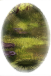

Локация для оруженосцев, которая соединяет другие номерные.

Ежевичный Полог делится на две ветви: **левую** и **правую**.

В правой части есть несколько важных локаций: питьевая локация Затопленная Водой Ложбинка, хранилище Скрытая Каморка (*вход запрещён без разрешения от верха племени*) и тренировочные логова, доступные всем грозовым жителям (Логово Дрожащих Стен, Заброшенное Паучье Логово и Логово Обтесанных Стен, Поросшая мхом полость, Место зарождения пламени, Скрытый корнями грот, Кротовое убежище, Зубчатая впадина).

Уход в оффлайн в логовах и Скрытой Каморке **запрещён**.

В левой части имеется не менее важная локация — Второй Коридор барсучьей норы.

Уход в оффлайн **разрешён**.

---

Чистильщикам⁵ запрещается относить занятых действием игроков: для этого существует так называемая **проверка на действие** — выполняется это посредством выполнения действия с котиком, которого чистильщик собирается отнести (например, «Помурлыкать вместе» или «Потереться носом о нос»): если кот занят действием, то слева всплывёт красная табличка с надписью о невозможности произвести действие с игроком ([например](https://i.ibb.co/C5Bns2q/o-BPin-FXLODw-1.jpg)); если нет, то значит, что котик свободен, и его смело можно отнести в номерные.

⁵ — [отряд](https://catwar.net/blog27148), который занимается уборкой ушедших из игры котиков с локаций для того, чтобы они стали свободнее, и туда смогли пройти более активные игроки.

---

### **Затопленная водой ложбинка (ЗВЛ)**

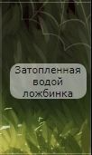

Локация, в которой доступно действие питья (только с трёх лун). Для того, чтобы выполнить это действие, надо сесть на клетку фона, на которой расположен ручеёк, протекающий вдоль локации.

Уходить в оффлайн **разрешено.**

---

### **Второй левый коридор барсучьей норы**

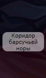

Локация, в которой сидит бот-хранитель [Сокрывший Грёзами](https://i.ibb.co/tMrzYRN6/HATQ.png). Ему можно отдать свои уникальные предметы на хранение или же просто [поболтать](https://i.ibb.co/XrbDnYrD/HATR.png) с ним насчёт предметов.

Уходить в оффлайн **разрешено**.

Бот не принимает целебные ресурсы, камни, ветки, игрушки, перья, ракушки и костюмы. Их придётся либо хранить самостоятельно, либо сдать в Скрытую Каморку.

---

### **Скрытая Каморка (СК)**

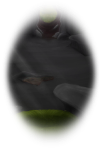

Локация-хранилище. Заходить туда без предварительного разрешения от представителей верха племени категорически **запрещено**!

---

### **Скрытый корнями грот (СКГ) и Поросшая мхом обитель (ПМО)**

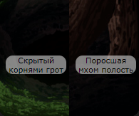

Локации, ведущие к сети логов для тренировок (Логово Дрожащих Стен, Заброшенное Паучье Логово и Логово Обтесанных Стен, Место зарождения пламени, Кротовое убежище, Зубчатая впадина).

Там проводятся команды и остальные мероприятия боевой академии.

Котятам данные локации посещать можно, но спать в них строго **запрещено**.

---

### **Куча с Добычей (КсД)**

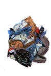

Локация, на которой можно поесть.

Взять еду можно у бота [Куча с Добычей](https://i.ibb.co/Hfv5RrGW/HAV5.png). Дичь он выдаёт только на определённых условиях: 10% голода, возраст больше трёх лун и наличие хотя бы одного свободного места во рту.

Кости оставлять просто так нельзя, надо отдать их боту, находящемуся по соседству —[Хранителю Костей](https://i.ibb.co/wr6Hy2Pv/HAV6.png), или смешать между собой. **Закапывать кости или ходить с ними по лагерю запрещается.**

Уходить из игры также **нежелательно**. Выносить еду из КсД и ходить с ней запрещено и карается подстилками.

---

### **Каменный Карниз (КК)**

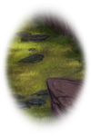

На Каменном Карнизе в определённые даты и время проводятся Собрания, на котором посвящают котят в оруженосцы, а оруженосцев — в воители, награждают статусами выше, выдают Двойное Имя, а также объявляют актуальные новости.

Оффлайн **нежелателен**. Больше про Собрания можно узнать в соответствующем [блоге](https://catwar.net/blog10645).

---

### **Уголок под Скалой (УПС)**

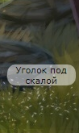

Из-за перенаполненности локации Каменный Карниз было решено ввести вторую локацию с объединённым чатом.

Выход из игры также **нежелателен**, но не наказывается.

---

### **Палатка воителей (ПВ)**

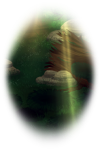

Место, где отдыхают воители нашего племени. Всего есть 5 номерных ПВ.

Заходить туда **можно**, как и выходить из игры. Но учти, что всех котиков со статусом ниже «воителя» точно унесут в номерные.

---

### **Палатка целителя (ПЦ)**

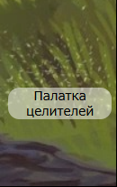

Там обитают целители и их ученики, происходит лечение заболевшего котика. Для того, чтобы не мешать целителям, заходить туда можно только им, больным и тем, кто принес целебные ресурсы.

Из Палатки Целителя можно пройти в две другие целительские локации: **Пещеру с Травами (ПСТ)** — хранилище целебных трав — и **Уголок Кашляющих (УК)**, где на своеобразном «карантине» ждут своего лечения заразившиеся насморком коты (это сделано для того, чтобы они при случайном контакте не заразили этой болезнью соплеменников).

Заход без причины во все три локации **наказывается** подстилками.

---

# Правила нахождения на локациях

## **Локации, запрещённые к посещению**

Пожалуй, стоит отдельно вынести локации, заход в которые не позволяется котятам нашего племени.

В нашем племени котятам дозволяется качать активность **не везде**. Во многие локации нельзя заходить в принципе, в другие — без уважительной причины. Прошу тебя запомнить список локаций, запрещённых к посещению котятами, и избегать захода туда. В противном случае тебя могут наказать подстилками или хуже.

1. В **Палатку Целителей (ПЦ), Пещеру с Травами (ПсТ) и Уголок Кашляющих (УК)** нельзя заходить без пониженного здоровья и разрешения от целителя или же при относе целебных ресурсов (что в статусе котёнка очень маловероятно), поскольку ты можешь потревожить больных и помешать работе целителя и его ученика. С перечнем болезней и требований для лечения стоит ознакомиться в [блоге Целительства](https://catwar.net/blog614397).
2. Запрещено также заходить в **Скрытую Каморку (СК)** без разрешения кого-либо из верха племени при наличии уважительной причины (отдать или взять уникальный предмет).
3. **Самое главное:** ни в коем случае не выходи из лагеря в **Берёзовую Рощу (БР)** и дальше. Без знания территории вне лагеря ты можешь легко заблудиться, зайти на чужую территорию, попасть на опасную локацию. Выход из лагеря наказывается на первые два раза подстилками, на третий — умерщвлением персонажа. Звучит не так весело, правда? Поэтому рекомендую дождаться посвящения в оруженосцы — тогда ты сможешь практически беспрепятственно выйти из лагеря и своими лапками спокойно изучить локации нашего леса. Или же ты можешь посетить экскурсию! Подробнее об этом можно узнать в [блоге лекторов](https://catwar.net/blog93145) в разделе “экскурсии”.

> Выходить в лес самостоятельно разрешено только котам от статуса «оруженосец», которым был проведён урок по территории от наставника.

---

В Игровой, помимо всего, есть **статусы активности персонажа**: [ **В игре** ], [ **Недавно ушёл** ], [ **Спит** ]. «В игре» обозначает, что ты находишься непосредственно в Игровой; «Недавно ушёл» появляется спустя 5 минут после выхода из Игровой или отсутствия в ней активности, а «Спит» — после целых 15 минут оффлайна.

Для поддержания активного статуса стоит обновлять страничку, выполнять какие-либо действия или переходить по локациям.

В связи с этим в нашем племени есть правила о том, что нельзя «спать» (не путай с непосредственным действием в Игровой) на некоторых локациях.

Выход из игры запрещён в следующих локациях: **Полянка для Игр (ПдИ), Расщелина меж Скал (РмС)**. В противном случае тебя унесут котики из отряда чистильщиков для того, чтобы очистить пространство, а ты можешь получить подстилки.

На первый выход из игры ты получишь лишь предупреждение, на второй — 40 подстилок, на третий и четвёртый — 65 и 80 соответственно.

В случае, если ты вышел из игры на неположенной локации по уважительной причине (например, сбой игры или связи), то можно отозвать наказание, обратившись к Главному Чистильщику, написав сообщение с темой и прикрепив оправдывающие тебя скриншоты.

---

# Вопросы и задания

Сейчас я задам тебе парочку вопросов, дабы убедиться, что ты внимательно прочитал урок.

> Важно: отвечать на вопросы нужно самостоятельно, не копируя информацию из уроков или других источников. Это подготовит тебя к сдачи тестов и экзаменов, где копирование и вставка строго запрещены.

### **Теоретические вопросы:**

1. *Пасмурные деньки ушли, выглянуло солнце, а значит, можно смело бежать в лагерь и заглянуть в гости, скажем, к целителю. Или нет? Что же там тебе говорили про места, запрещённые к проходу малышам?*

   Какие локации нельзя посещать, будучи котенком?

2. *На яркий свет сбежались жители племени, коты греют бока под лучами и не замечают, как погружаются в сладкий сон.*

   Что обозначает статус [ Спит ]?

3. *Но никакая дремота не манит так сильно, как эти загадочные кусты, ведущие в лес. А может стоит выйти и хоть одним глазком взглянуть на местность за лагерем?*

   Можно ли котёнку выходить в Берёзовую рощу? Объясни свой ответ.

4. *Солнышко припекает всё сильнее, и лапки так и тянутся охладиться в прохладной водичке. Вон как заманчиво блестят зелёные листья на водной глади! Ой, а не слишком ли это глубоко для таких маленьких лапок?*

   Почему на локации «Усеянный Кувшинками Прудик» котята могут плавать абсолютно безопасно и без риска утонуть?

5. *Все куда-то бегут, стремительно перепрыгивая из палатки в лагерь и обратно. Когда-нибудь и ты так сможешь, когда-нибудь не будешь тратить много времени на переход.*

   В чем разница между обычной и недельной активностью?

### **Задания:**

1. Отправь мне скриншот, где будет видно хотя бы один твой переход в другую локацию.
2. Прочитай ЧаВо и расскажи кратко, о чём он и что можно в нем найти.

Не волнуйся, если ты напишешь неправильно, мы всё с тобой разберём.

Не забывай писать вопросы перед ответами. Скриншоты отправляй только простой ссылкой без кодов или только с помощью кода [img].

---

На этом наш урок закончен. Попрошу ответить на вопросы и выполнить задания, чтобы получить следующий урок. Если остались вопросы — смело задавай их мне.

Если хочешь получить ещё больше информации про игру, то прочитай [ЧаВо](https://catwar.net/blog27) полностью, а также разделы Об игре про [активность](https://catwar.net/about?id=6), [рост](https://catwar.net/about?id=24), [тёмные баллы](https://catwar.net/about?id=21) и [запахи](https://catwar.net/about?id=11).

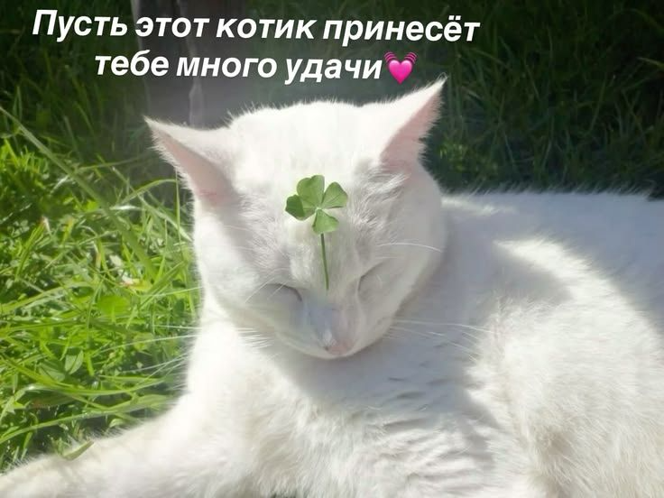

