<link rel="stylesheet" href="style.css">

# Урок 2. Параметры, навыки и действия

### **Привет, котёнок!**

В сегодняшнем уроке ты больше узнаешь про *параметры и навыки*, а также действия, которые ты сможешь совершать со своим и другими персонажами.

---

Итак, **параметры и навыки** отображают состояние и развитие персонажа; **действия** же помогают восполнять параметры персонажа и прокачивать навыки. **Набор действий** зависит от места пребывания персонажа, его состояния, предметов во рту и другого.

---

# Параметры

**Параметры** находятся во вкладке «Персонаж» в нижней части Игровой, справа от Истории. Разделяются на «Состояние» (параметры снижаются и требуют восстановления) и «Потребности» (параметры растут со временем и требуют утоления).

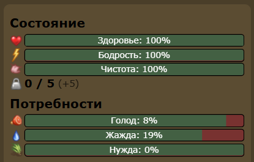

**Всего в игре существует 6 параметров:**

**Состояние:**

1. Здоровье;
2. Бодрость;
3. Чистота.

**Потребности:**

1. Голод;
2. Жажда;
3. Нужда.

---

## Бодрость

Понижается после тренировок, плавания и от просто долгого передвижения по Игровой. Этот параметр **не является смертельным**.

> **Исключение:** плавание, ныряние. Мешает тренировкам и осмотру дупел/расщелин.

Восполняется данный параметр действием *«Поспать»* (1) или с помощью действия *«Зевнуть»* (2) (только с 25 до 50 минут).

Иногда действие «Зевнуть» может наоборот повысить количество сна.

(1):

(2):

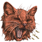

---

## **Голод**

Понижается со временем и в зависимости от активности персонажа. Восполняется действиями *«Испить молока»* (1) у королевы (**до 3 лун**) или *«Съесть (тип и название дичи)»* (или вариациями этой фразы) (**после 3 лун**) , которое появляется в списке действий под предметом.

Взять дичь можно у бота Куча с Добычей, сидящего в одноимённой локации при следующих **условиях**: возраст больше 3 лун, минимум 10% голода и 1 свободное место во рту. Дичь можно взять посредством проведения диалога с ботом через действие *«Поболтать»* (2), доступном только для разговора с ботами, а *кости* (3) **обязательно сдать боту Хранитель Костей**.

> Понижение голода до нулевой отметки сулит смертью персонажу.

(1):

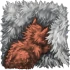

(2):

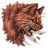

(3):

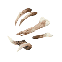

Действие во рту:

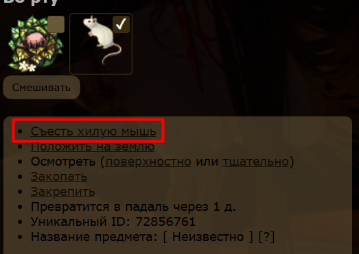

---

## **Жажда**

Аналогична голоду: понижается со временем и в зависимости от активности. **До 3 лун** ты, опять же, можешь восполнять параметр с помощью *молока королев*. Помимо этого, все коты нашего племени могут попить в лагерной локации **Затопленная водой Ложбинка (ЗВЛ)**: для этого нужно сесть на клетки с водным фоном, на которых тебе откроется действие *«Попить воды»* (1).

> Доведение жажды до нулевой отметки может привести к смерти персонажа.

(1):

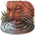

---

## **Нужда**

Понижается от употребления добычи или от питья молока королевы. Восполняется действием *«Справить нужду»* (1) в локации **Грязное место (ГМ)**. **Не является смертельным параметром.**

(1):

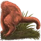

---

## Здоровье

Cамый важный параметр. Падает от получения различных увечий. От низкого здоровья повышается переход, иногда становятся недоступны некоторые действия. При понижении данного параметра всегда стоит обращаться к целителю (актуальный состав целителей можно узнать в Главном блоге Грозы/Теней), который осмотрит тебя при помощи действия *«Осмотреть кота»* (1) (для того, чтобы вылечить себя, целители могут использовать действие *«Осмотреть себя»* (2)). Оба действия доступны только **при наличии Целительских Умений**.

---

### Я заболел! Что делать?

В игре есть несколько болезней и травм, которые персонаж может получить в течение своей жизни. Давай разберём их поподробнее.

| Название дефекта    | Получение                                                                                                                                                                                                                                                                                                                                                                                    | Действия после получения                                                                                                                                                                                                                                                                                                                                                                                |
| ------------------- | -------------------------------------------------------------------------------------------------------------------------------------------------------------------------------------------------------------------------------------------------------------------------------------------------------------------------------------------------------------------------------------------- | ------------------------------------------------------------------------------------------------------------------------------------------------------------------------------------------------------------------------------------------------------------------------------------------------------------------------------------------------------------------------------------------------------- |
| Раны                | Раны могут появиться после получения урона от других котиков в опасных боережимах Т+2 и Т+3; падения с высоких лазательных локаций; ловле рака на нырятельных локациях. Сопровождаются кровотечениями, от которых может падать здоровье.                                                                                                                                                     | При получении ран не надо выполнять никаких действий, в том числе переходов, кроме вылизывания (стоит выполнять это действие до полного его исчезновения; перепроверять его наличие можно обновлением странички, но только если действие "вылизаться" пропало!). Стоит уведомить целителя о случившемся попросить кого-то из котов постарше поднять тебя и отнести в Палатку Целителей.                 |
| Отравление          | Отравиться можно, съев падаль, гниль, кости, мох, камни, неправильно обработанную траву; при выпадении травящей дичи на лазательных и нырятельных локациях.                                                                                                                                                                                                                                  | Можно выполнять различные действия — здоровье не изменится. Не стоит торопиться бежать к целителю, перед этим надо написать ему в Личные Сообщения, объяснив, каким образом ты отравился.                                                                                                                                                                                                               |
| Простуда            | Простудиться можно, если попить из лужи в холодную погоду.                                                                                                                                                                                                                                                                                                                                   | Стоит самостоятельно добраться в ПЦ или попросить кого-то из старших отнести тебя туда, а также не забудь отписаться целителю.                                                                                                                                                                                                                                                                          |
| Травмы от утопления | Получить данный вид травм можно только на плавательных локаций, чей уровень ПУ равен или выше 2, при наличии большого количества сна (45+ минут). При продолжении нахождения на плавательных локациях эти травмы могут обернуться смертью персонажа.                                                                                                                                         | Срочно покинуть плавательные локации или попросить кого-то тебя вытащить, не совершать никаких действий в воде, стремиться выйти на сушу. После выхода на берег стоит отправиться в Палатку Целителей (или попросить кого-то отнести тебя, но необязательно) и написать целителю о случившемся.                                                                                                         |
| Переломы            | Получить переломы можно только упав с лазательных локаций. Иногда сопровождается кровотечением (в таком случае не стоит совершать никаких действий; без него — можно).                                                                                                                                                                                                                       | Сразу же отписаться целителю и ни в коем случае не лезть назад на лазалки (только если от целителя не получено разрешение). Целитель назначит самолечение или наложит костоправ на определённое время в зависимости от тяжести переломов. Для получения костоправа требуется написать оставшееся количество здоровья и отправиться в ПЦ (при слишком высоком переходе можно попросить кого-то донести). |
| Клещи и блохи       | При длительном копании без вылизывания можно приобрести себе маленьких друзей в виде клещей или блох. Клещи появляются после времени вылизывания 1 час 21 минута 40 секунд; блохи — при дальнейшем копании.  Грязь 1 стадии: 1-25 действий копать землю  Грязь 2 стадии: 26-50 действий копать землю.  Клещи: 51-75: действий копать землю.  Блохи: 76-∞: действий копать землю. | Написать целителю с просьбой о чистке: когда в племени будет достаточное количество мха с мышиной желчью, он позовёт тебя на чистку.                                                                                                                                                                                                                                                                    |

Ознакомиться с тем, как выглядят дефекты персонажа на разных стадиях, можно на этом [сайте](https://catwar.fandom.com/ru/wiki/%D0%94%D0%B5%D1%84%D0%B5%D0%BA%D1%82%D1%8B).

#### **За некоторые болезни предусмотрено наказание:**

1. Поедание травящих предметов: подстилки выдаются на усмотрение целителя.
2. Безответственное отношение к своему здоровью: 100 подстилок.
3. Пренебрежение инструкциями по ношению костоправа: 20-200 подстилок.

Со всеми болезнями и требованиями на лечение можно ознакомиться в блоге [Целительства](https://catwar.net/blog14254).

> Понижение параметра «здоровье» может грозить смертью.

(1):

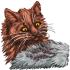

(2):

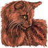

---

## Чистота

Падает от копания земли, закапывания предметов и частых переходов. Восполняется действием *«Вылизаться»* (1) или же *«Вылизать»* (2). Второе действие можно совершить только с другими. При клещах и блохах от вылизывания чистота не восстановится, а действие будет длиться стандартные минуту и сорок секунд, придётся идти к целителю за мхом с мышиной желчью.

В нашем племени заведение клещей и блох у котят не наказывается. Не является смертельным параметром.

(1):

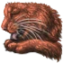

(2):

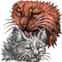

---

# Навыки

**Навыки** — это умения персонажа. Находятся справа от Истории, под параметрами.

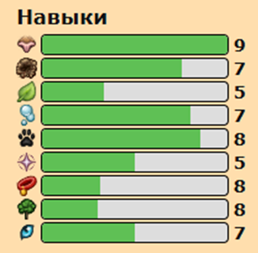

**Всего существует 10 навыков:**

1. Нюх;
2. Копание;
3. Плавание;
4. Боевые умения;
5. Лазание;
6. Зоркость
7. Целительство;
8. Верность двуногим;
9. Мастерство;
10. Могущество.

Все навыки имеют **9 уровней*** и полностью идентичны друг другу по количеству единиц, которые надо набрать для того, чтобы повысить уровень.

Существует две группы навыков: **базовые** (те, что доступны с момента регистрации: *нюх, копание, боевые умения*) и **приобретённые** (те, которые появляются после каких-либо действий игрока: *плавательные умения, лазательные умения, зоркость, целительство, верность двуногим, мастерство, могущество*).

** – мастерство имеет только 3 уровня.*

---

### **Нюх (Уровень Нюха; УН)**

Важный навык, уровень которого влияет на успешность охоты и осмотра расщелин. Повышается действием *«Обнюхать землю»* (1), *«Обнюхать кота»* (2) или поимкой дичи на внелагерной территории: второе доступно только при взаимодействии с другим игроком.

Действие появляется раз в определённое время: изначально раз в час, но по мере возрастания навыка время между обнюхиваниями сокращается.

**При наличии 4 УН** игроку становится доступным действие **осмотра предмета**: *поверхностного и тщательного*. Оно доступно при нажатии на предмет, который ты держишь во рту, и позволяет узнать, кто и какие действия совершал с данным предметом, сколько использований у него осталось и тому подобное.

(1):

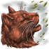

(2):

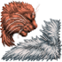

Если нажать на иконку нюха в навыках, то появится окошко, в котором будет написано, сколько осталось времени до следующего действия:

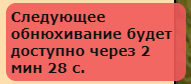

---

### **Копание (Копательные Умения; КУ)**

Навык, влияющий на то, насколько глубоко ты можешь закопать предметы. Повышается действием *«Копать землю»* (1) или *«Закопать предмет»* (2) (доступно при нажатии на предмет, который ты держишь во рту; можно выбрать уровень, на который ты хочешь закопать предмет, но он не должен превышать уровень твоего КУ). Предмет можно откопать только на той клетке, на которой он был закопан.

(1):

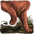

(2):

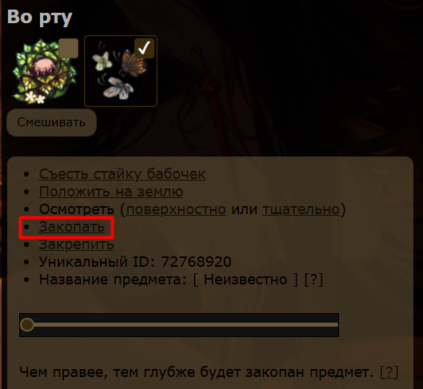

---

### **Плавание (Плавательные Умения; ПУ)**

Навык, прокачивание которого доступно только на плавательных локациях при помощи действий *«Поплавать»* (1) или *«Нырнуть»* (2). Влияет на выпадение ресурсов при нырянии. К тому же, чем выше ПУ, тем медленнее персонаж утонет на плавательных локациях с уровнем вод выше единицы.

При плавании добавляется небольшое количество единиц ПУ, зависящее от твоего уровня данного навыка и уровня ПУ локации. С 5 уровня на определённых локациях появляется возможность нырнуть: выпадание единиц ПУ при нырянии зависит от твоего текущего уровня навыка, забитости рта и фракции. Так, на 5 уровне можно максимум получить +10 единиц, а на 8 — +4. Количество полученных единичек уменьшается вдвое, если у тебя забиты все основные места во рту предметами, а ныряя с открытым ртом, можно выловить различные предметы (целебные ресурсы, рыбу, травящую дичь и многое другое).

Длительность ныряния высчитывается по следующей формуле: [**130 − уровень ПУ игрока * 5**].

Для прокачки навыка на локации Усеянный Кувшинками Прудик (УКП) тебе не нужно вступать ни в какие отряды. Однако если ты хочешь получать баллы, а в дальнейшем и медаль за свои старания, то предварительно необходимо получить активность «Улучшающаяся» и отписаться в [блоге Пловцов](https://catwar.net/blog55622) по шаблону для Мальков: «Я, [ID], грозовой, имею активность „Улучшающаяся“ и желаю стать мальком».

Чтобы посещать Дно Цветущей Заводи за пределами лагеря для ныряния, нужно иметь активность «Ходячий миф» (минимум 350/1000) и 5 ПУ. По достижении этих значений следует подать заявку в сообщество ВК и отписаться в ЛС по шаблону: «Имя [ID] — нырки с пловцами (Гроза). [Скриншоты выполненных требований с дробями]».

> **Важно!** Прокачивать ПУ посредством ныряния могут только лягушата в сопровождении пловцов, а также коты, состоящие в отряде Пловцов и занимающиеся сбором ресурсов со дна.

(1):

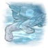

(2):

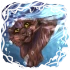

---

### **Боевые умения (БУ)**

Важный навык, отражающий силу и мощь персонажа. Чем выше навык, тем сильнее твой персонаж и тем сложнее его ранить или убить. Повышается при помощи тренировок.

Для того, чтобы начать тренировку, нужно войти в боережим через действие *«Войти в боережим»* (1), а для её окончания стоит нажать на действие *«Успокоиться»* (2).

После каждой тренировки ты получаешь определённое количество единиц БУ. Пока ты котёнок до 6 лун, ты будешь получать всего лишь +1 единицу БУ, после  — от 1 до 15. На количество выпадаемых БУ влияет соразмерность уровня твоего противника, используемая тактика, одинаковое количество ударов с обеих сторон и один из боевых параметров.

Этот навык влияет на твоё посвящение в оруженосцы, поскольку **для выдачи статуса нужен минимум 3 уровень БУ**.

Когда вырастешь, сможешь попробовать себя в нашем главном боевом отряде — [Школе Танцев](https://catwar.net/blog97212), который занимается охраной Грозовых земель от нападения Барсука и иноплеменных котов.

С 6 лун у игроков появляются **Боевые параметры (БП)**, которые упрощают прокачку Боевых Умений или помогают в активном бою. Генерируются они случайно, заранее выбрать свои БП, увы, нельзя.

Дополнительно по достижении 7 БУ есть возможность узнать свои БП, нажав на иконку (3) в своём профиле. В зависимости от уровня БУ боевые параметры могут раскрываться подробнее:

- с 7 БУ показывается только лидирующий параметр:

- с 8 БУ все боевые параметры будут показываться списком с приблизительными значениями:

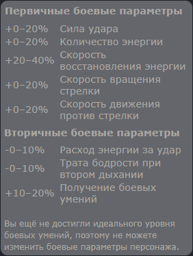

- с 9 БУ игрокам предоставляются точные значения каждого параметра:

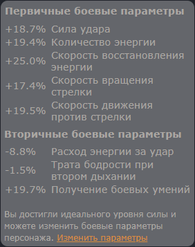

> Так же появляется возможность смены БП.

#### Список боевых параметров:

*Первичные:*

• Сила удара;

• Количество энергии;

• Скорость восстановления энергии;

• Скорость вращения стрелки;

• Скорость движения против стрелки.

*Вторичные:*

• Расход энергии за удар;

• Трата бодрости при втором дыхании;

• Получение боевых умений.

Подробнее ты узнаешь в уроках от своего наставника, в этом [посте](https://catwar.net/sniff1159564) от администрации сайта и на [странице](https://catwar.net/change_parameters) смены БП.

(1):

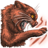

(2):

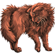

(3):

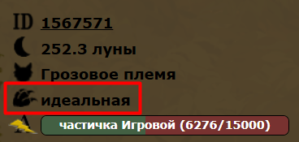

---

### Как повышать навык? Что такое грушевание?

Для начала надо перейти в боережим, после этого по выбранной тобой тактике (например, 331, где первые две цифры — количество ударов, а последнее — количество кругов) потренироваться и завершить тренировку. Бить стоит в хвост или лапы. Фактически, можно бить в любое место, но именно эти два варианта минимальны в затратах энергии, а следственно, увеличится и время, проведённое за тренировкой, что негативно влияет на выпадение БУ. Поэтому при желании можно бить друг друга хоть в горло, но польза от такой тренировки сомнительна.

Не забывай крутить стрелочку и выходить из боережима сразу после того, как тренировка завершилась. Не рекомендую начинать тренировку, если у тебя очень много сна; если ты решил провести сразу много тренировок, можешь отсыпаться между тренировками или после них.

**Горячие клавиши боережима:**

**• I** — обычный удар;

**• O** — удар с помощью второго дыхания;

**• L** — вращать стрелу по часовой стрелке;

**• J** — вращать стрелу против часовой стрелки;

**• K** — блокирование удара;

**• T+1** — безопасный режим;

**• T+2*** — опасный режим с когтями;

**• T+3*** — опасный режим с зубами.

> * — запрещено использование данных режимов в тренировках и заход в них вне соответствующих ситуаций.

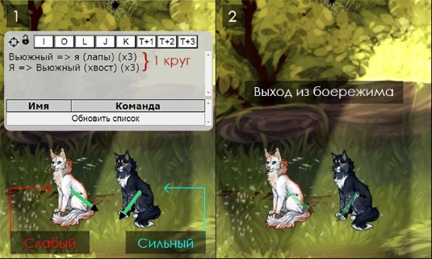

Грушевание — это особый вид тренировки, при котором прокачивается только один котик, а остальные (один или двое) ему в этом помогают. Название пошло от понятия «груша для битья», потому что груши из боевого режима не выходят на протяжении всего времени кача. Имеет два вида: **одиночное** [[тык](https://d.zaix.ru/HBAV.jpg)] и **двойное** [[тык](https://i.ibb.co/Q3M1zLm2/HBAU.jpg)].

В первом участвует один сильный кот, выполняющий сразу пассивные и активные функции, а во втором задействованы более слабая активная груша и сильная пассивная груша.

Будучи котёнком, ты можешь поучаствовать в грушевании в качестве активной груши (нужно иметь 5 БУ) и за 140 баллов получить [медаль](https://i.ibb.co/j2DRpLq/image.png) «За активную прокачку соплеменников».

Подробнее в блоге [Грушевания](https://catwar.net/blog789038).

---

### **Лазание (Лазательные Умения; ЛУ)**

Полезный навык, доступный к повышению на лазательных локациях путём передвижения по безопасным клеткам. Прокачивание данного навыка опасно тем, что падение с лазательных локаций сулит получением ушибов или может иметь летальный исход (однако чем выше ЛУ, тем меньше получаемый урон).

Посещение горных локаций для лазанья доступно только членам отряда [Крыланов](https://catwar.net/blog679641). Однако домашние локации (в нашем племени это Небесный Дуб) свободны для посещения любым игроком* до 4-го уровня локации включительно.

** — кроме котят и переходящих.*

Если ты, будучи котёнком, хочешь прокачать ЛУ или УЗ, тебе необходимо вступить в подотряд Мотыльков. Для этого нужно иметь активность не ниже «Замечательнейшей» и отписаться в ВК или в ЛС на сайте Командору либо Маршалу. По желанию можно вступить в конференцию для более удобной коммуникации с членами отряда. Просить помощи с прокачкой навыка можно как лично у определённого Крылана, так и в предназначенной для этого беседе.

Мотыльки, не имеющие 4-го уровня ЛУ, могут запросить у Командора или Маршала синие перья при наличии перерождения либо активности «Легенда сайта».

Подробнее в блоге [Крыланов](https://catwar.net/blog679641).

---

### **Зоркость (Уровень Зоркости; УЗ)**

Навык, который также прокачивается на лазательных локаций с помощью действий *«Осмотреть окрестности»* (1), *«Осмотреть дупло»* (2) и *«Осмотреть расщелину»* (3). При выполнении навыка можно увидеть котов и предметов, находящихся на соседних локациях.

Влияет на успешность выпадения предметов на лазательных и водных локациях, а при **6 УЗ** во время осмотра дичи можно узнать, кто её поймал.

От каждого осмотра окрестностей понижается параметр сонливости, а действие начинает длиться дольше, поэтому прокачивать УЗ долго, к сожалению, не получится: придётся отоспаться. Во время осмотра дупел и расщелин, которые **доступны раз в час**, может выпасть какой-то предмет (целебный ресурс, травящая дичь и другое).

(1):

(2):

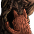

(3):

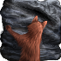

---

### **Целительские умения (ЦУ)**

Навык, доступный лишь целителям племени. Выдаётся администрацией и повышается с помощью наложения целебных трав и паутины на больных котиков через действие *«Наложить траву»* (1). Чем выше уровень ЦУ, тем эффективнее лечение.

(1):

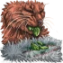

---

**Верность Двуногим (ВД)**

Навык, доступный для прокачки только Домашним котам. Достигнув определённого количества единиц ВД навыка, кот имеет шанс стать Домашним.

Появляется и повышается при взаимодействии с Двуногими через действия *«Привлечь внимание»* (1) и *«Почистить ковер»* (2). Каждое из действий добавляет лишь +1 единицу ВД; второе доступно уже домашним.

Подробнее узнать про то, как прокачать ВД, можно узнать по этой [ссылке](https://catwar.net/about?id=33).

(1):

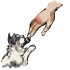

(2):

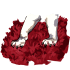

---

### **Мастерство**

Особый навык, также доступный для прокачки только Домашним котам. В отличие от всех других навыков, имеет только 3 уровня.

Позволяет делать различные [поделки](https://i.ibb.co/ZbQsKsh/c-SJz.jpg), с помощью которых можно повышать Верность Двуногим, а также создавать бантики и ошейники, которые можно надеть на персонажа.

---

### **Могущество**

Навык, доступный только погибшим котам, обитающим в Звёздном племени.

Требуется для совершения перерождения или получения гетерохромии (разных глаз) и особого окраса.

Повышается с помощью передачи [звёздной пыли](https://i.ibb.co/4wqmpp5W/y-K5w.png) боту по имени Млечный Путь. Её можно собрать во время спавна в определённое время или же обменять выловленных [звёздных мышек](https://i.ibb.co/qhbN0pp/mf-IF.png) у бота по имени **Барсик**.

---

# Действия

Мы разобрали не все действия, лишь те, которые влияют на навыки и действия. Давай же рассмотрим оставшиеся действия.

---

### **Охота**

**«Охотиться»**

Охота на определённый вид дичи.

[Подробный гайд по охоте](https://i.ibb.co/XcDdnV9/o-Au-A.png).

Иконка действия:

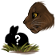

**«Резвиться и прыгать»**

Аналог настоящей охоты для котят, на которой можно поймать бабочек и светлячков.

Иконка действия:

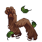

---

### **Проценты Пары**

Для заведения котят (как родных, так и приёмных) существуют **проценты пары**, находящиеся под «Генеалогическим кустиком». Они повышаются благодаря определённым действиям, каждое из которых добавляет определённое количество ПП. Появляются с 20%, но родных котят можно заводить только при 100% и при нажатии на определённый значок (♡).

Выглядят они следующим [образом](https://i.ibb.co/d057BQD7/HBp7.jpg): в первом случае можно завести только приёмных котят, во втором — родных и приёмных.

#### **Действия для повышения ПП:**

**«Помурлыкать вместе»**

Длится 1 минуту 40 секунд и прибавляет 1% пары.

Иконка действия:

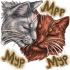

**«Повалять по земле»**

Длится 1 минуту 15 секунд и прибавляет 0.7% пары.

Иконка действия:

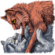

**«Переплести хвосты»**

Длится 20 секунд и прибавляет 0.4% пары.

Иконка действия:

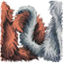

**«Потереться носом о нос»**

Длится 15 секунд и прибавляет 0.2% пары.

Иконка действия:

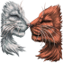

**«Потереться щекой о щёку»**

Длится 10 секунд и прибавляет 0.2% пары.

Иконка действия:

---

### **Другое**

**«Поднять»**

Можно поднять игрока, находящегося на соседней клетке. Поднимать можно только тех, кто младше/меньше тебя.

Иконка действия:

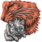

**«Обмен предметами»**

Удобный обмен предметами или кролями с игроком, находящимся рядом. Обмениваться можно только с теми, кто находится в твоём списке друзей (второй котик тоже должен добавить тебя в друзья).

Иконка действия:

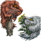

**«Наполнить мох водой»**

Наполнение [водяного мха](https://i.ibb.co/DHbVw3DT/HBo-E.png) водой для того, чтобы из него потом можно было попить воды. Приобретает следующий [вид](https://i.ibb.co/84LnCMm4/4bv-F.png).

Иконка действия:

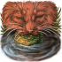

---

# Места во рту

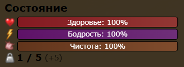

Рядом с параметрами, под чистотой, ты мог заметить некую гирю — она обозначает **количество мест во рту** персонажа. Количество мест разделяется на **базовое и запасное** (на скрине 5 базовых и 5 запасных места). Разберём поподробнее.

Количество базовых мест зависит от роста персонажа (сам он зависит от возраста и уровня БУ). Количество запасных мест может быть от 0 до 5, действует по следующей схеме:

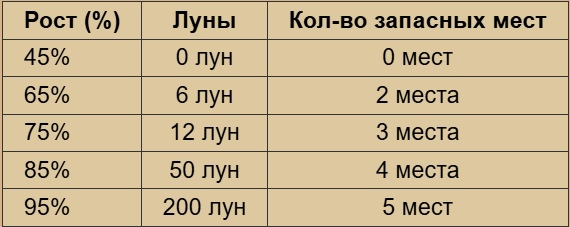

> Поднять предмет, который занимает вес больше базовых мест во рту, не получится.

**Перевес** происходит тогда, когда какие-либо предметы или коты начинают занимать запасные места во рту. В состоянии перевеса число текущих занятых мест и количество базовых мест выделяются **красным** цветом. Для наглядности:

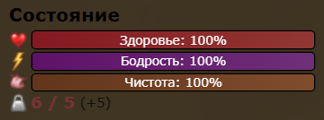

Так, с полностью забитыми местами нельзя будет выловить что-то при осмотре дупла или расщелины, а во время охоты дичь будет появляться только в базовые места во рту. Некоторые предметы нельзя получить с помощью обмена, если заняты базовые места.

---

Вес поднимаемого котика зависит не только от его роста, но и от предметов, находящихся у него во рту. Можно высчитать вес котика по следующей формуле: [**базовый вес кота + 75% от веса всех его предметов во рту**].

Базовый вес кота:

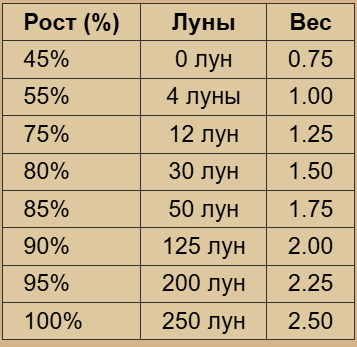

**Поднять котика ты можешь в следующих случаях:**

1. Тебе больше шести лун;
2. Его вес не превышает количество твоих свободных мест во рту (суммарно базовых и запасных);
3. Его рост меньше, чем у тебя.

Переход от поднимаемых котов не увеличивается (только от забитых запасных мест).

---

# Вопросы

Как и полагается в конце урока, сейчас будет блок с вопросами и заданиями!

**Важно:** отвечать на вопросы нужно самостоятельно, не копируя информацию из уроков или других источников. Это подготовит тебя к сдачи тестов и экзаменов, где **копирование и вставка строго запрещены**.

### **Теоретические вопросы:**

1. *Ловкости воинов можно позавидовать, кажется, будто это настоящие мастера в боях, копании и выслеживании дичи. Ты тоже займёшься этим, но сначала надо бы поесть.*

**Что такое параметры и навыки? На что делятся параметры?**

2. **Опиши 1 любой навык и параметр, доведение которого до 0% гарантированно приведёт к гибели персонажа.**
3. *Вот только проблема возникает и тут. Да из этой кучи почти невозможно достать хоть что-то, как же высоко находится та самая сочная мышь!*

**При каких условиях можно взять дичь из Кучи с Дичью?**

4. *Свернувшись клубочком на подстилке, ты лениво размышляешь о том, как устроен этот мир. Вот почему один твой соплеменник пушинкой взлетает на дерево, а другой оставляет глубокие следы на влажной земле?*

**Из каких двух составляющих складывается итоговый вес любого котика в игре?**

5. *Случайно забрёв не туда, ты увидел тренировку взрослых котов и заметил, что каждый из них силён по-своему: одни быстрее, другие сильнее. Со временем ты тоже сможешь вырасти и найти собственную силу.*

**С какого уровня БУ открывается приблизительное описание боевых параметров? Сможешь ли ты изменить их в будущем?**

## **Задания:**

1. **Представь, что перед попаданием на должность тебе нужно накачать 1 БУ. Отправь мне скриншот, подтверждающий твой уровень навыка.**
2. **Перейди на локацию Усеянный Кувшинками Прудик и соверши одно действие плавания. Укажи, сколько процентов бодрости осталось у твоего персонажа и какой уровень ПУ отображается теперь в навыках.**

*Не волнуйся, если ты допустишь какие-то ошибки, мы с тобой всё вместе разберём.*

---

На этом наш урок подошёл к концу. Прочитай урок внимательно, ответь на вопросы и выполни задания для того, чтобы получить следующий урок.

Если тебе осталось что-то непонятным — смело пиши мне.

Для получения дополнительной информации можешь прочитать [ЧаВо](https://catwar.net/blog27), некоторые разделы «Об игре» ([Параметры](https://catwar.net/about?id=31), [Семья и пара](https://catwar.net/about?id=28), [Нюх](https://catwar.net/about?id=20), [Охота](https://catwar.net/about?id=34), [Копание](https://catwar.net/about?id=12), [Боевые умения](https://catwar.net/about?id=8), [Плавание](https://catwar.net/about?id=4), [Лазание](https://catwar.net/about?id=36), [Зоркость](https://catwar.net/about?id=37), [Верность Двуногим](https://catwar.net/about?id=33), [Мёртвые и бесплеменные](https://catwar.net/about?id=13)), а также статьи Catwar wiki про [параметры](https://catwar.fandom.com/ru/wiki/%D0%9F%D0%B0%D1%80%D0%B0%D0%BC%D0%B5%D1%82%D1%80%D1%8B), [навыки](https://catwar.fandom.com/ru/wiki/%D0%9D%D0%B0%D0%B2%D1%8B%D0%BA%D0%B8) и [действия](https://catwar.fandom.com/ru/wiki/%D0%94%D0%B5%D0%B9%D1%81%D1%82%D0%B2%D0%B8%D1%8F).

---

