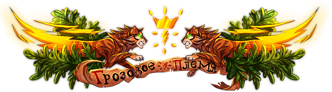
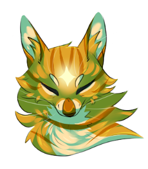
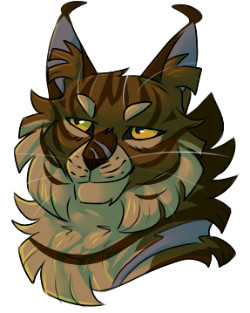
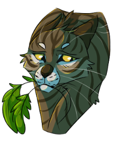
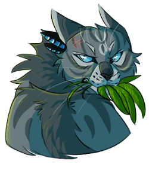
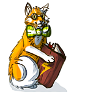

<link rel="stylesheet" href="style.css">

# Урок 4. Грозовое племя

## **Приветствую, мой маленький котенок!**

Сегодня мы поговорим о нашем племени: его лоре, иерархии, представителях власти, блогах, требованиях для посвящения в оруженосцы, а также затронем котячью деятельность.

Начнём!

---

# Иерархия

**Иерархия** — система взаимодействия между должностями.

**В Грозовом племени иерархия следующая:**

Предводитель → глашатай → старший советник/целитель/ученик целителя → младший советник → ведущий воитель* → старший воитель → воитель/старейшина → оруженосец/переходящий → котенок/переходящий.

** — уникальная должность союзного племени. Подробнее можно будет узнать ниже.*

Должность соплеменника в любое время можно посмотреть в Игровой, наведя на фигурку персонажа, или же в профиле игрока. В обоих случаях они находятся рядом с именем, а иноплеменных котиков — только при непосредственном нахождении с ним на одной локации.

---

# Представители власти

Главным в нашем племени является верх племени: предводитель, глашатай, советник, целитель и его ученик. Они несут ответственность за всё наше племя, представляют его на Советах, реализуют идеи и многое-многое другое.

---

## Предводитель

У каждого племени есть свой лидер — **предводитель**. Он является главой и опорой племени. Предводитель должен подавать хороший пример и вести свое племя по пути Воинского закона. Он созывает собрания племени, посвящает, назначает юным котам наставников и вместе с глашатаем и доверенным кругом приближенных определяет политику и стратегию племени.

Сейчас место предводителя занимает [Клок Кометы](https://catwar.su/cat1681958).

---

## Глашатай

У предводителей есть последователи, которых называют **глашатаями**. Они помогают лидеру управлять племенем. Глашатай заменяет предводителя в его отсутствие и становится предводителем после его смерти (или отставки).

Данными помощниками являются [Зенит](https://catwar.su/cat1676367) и [Апогей](https://catwar.su/cat1242238).

---

## Советник

В нашем племени есть также и **советники**, которые вместе с предводителем и глашатаем помогают процветанию племени. Советник может стать предводителем, если его выберут в глашатаи, а также самостоятельно изгонять котиков из племени.

На данный момент у нас существует разделение на старших и младших советников.

Старшие — [Придира](https://catwar.su/cat1256574), [Мор](https://catwar.su/cat179485), .

Младшие — [Лёгкая Лапа](https://catwar.su/cat1585395), [Лососик](https://catwar.su/cat109925), [Певчая Цикада](https://catwar.su/cat1550407), [Сон Котёнка](https://catwar.su/cat1695967), [Рябинка](https://catwar.su/cat1673837), [Горностай](https://catwar.su/cat162249), [Пламя Сражения](https://catwar.su/cat1656987).

---

## Целитель

Далее идёт **целитель**. Он заботится о здоровье племени, а также собирает травяные патрули, необходимые для сбора целебных ресурсов. Ученика выбирает сам.

Наши целительницы — [Отражение](https://catwar.su/cat1638432), [Ссора](https://catwar.su/cat569067) и [Песнь](https://catwar.su/cat1568486), [Слепозмей](https://catwar.su/cat1663552).

---

## Ученик целителя

**Ученик целителя** помогает своему наставнику во всём и учится у него премудростям врачевания. После окончания обучения может стать полноценным целителем племени.

Сейчас ученики целителя отсутствуют.

---

# Основной состав племени

**Котёнок.** Самый младший член племени. Грозовое племя очень любит своих малышей и потому безмерно балует их. Котята имеют гораздо больше развлечений, чем в других племенах: играют в разные игры и слушают сказки, посещают лекции, ходят в походы и многое другое. Котята даже могут пойти на какую-нибудь должность, например, на *Творца* и *Художника* (если подходит по требованиям и в данное время открыт набор). Обучает котёнка *воспитатель*, которого ему выдаёт *распределяющий*.

**Оруженосец.** Период жизни котёнка после своего первого посвящения. Оруженосцы должны проходить обучение у своих наставников: о территории, охоте, боях и культуре. Оруженосцы могут наравне с воителями ходить на охоту, в дозоры и патрули. Помимо остальных требований ученики выполняют практику для посвящения в воители, а также сдают **Обязательный Воинский Экзамен (ОВЭ)**.

**Воитель.** Стать воителем можно сразу же после выполнения всех требований для посвящения. На данной ступени иерархии коты имеют больше возможностей; в частности, собрать племенную иерархию в отсутствие котиков, стоящих выше по иерархии. Имеет больше возможностей: например, завести семью, собрать племенную деятельность в отсутствие котиков, стоящих выше по иерархии.

**Королева.** Эта кошка, которая только что «надулась» (забеременела), и у неё появились котята. Обычно королевы находятся в **Тёмных** и **Светлых покоях королев**, могут выкормить любого котёнка, которому не исполнилось 3 лун. Королевы сострадательны и добры, всегда готовы помочь котенку освоиться в племени: как своему, так и чужому. Имя матери и отца отображается в разделе «Родственные связи», в случае отсутствия родителей у игрока будут указаны боты Удар Грома и Сверкающая Молния. Такие котята могут выбрать себе приёмную* семью в блоге [Гильдии Чёрной Рыси](https://catwar.su/blog1191531).

* — приёмные родственники будут выделены курсивом.

> Статус с «воительницы» на «королеву» меняется автоматически, а вот для того, чтобы вернуть статус «воительницы» надо написать верху.

**Старший воитель.** Он старше и опытнее других воителей племени. Он вложил огромный вклад в жизнь племени и до сих пор работает для того, чтобы его племя процветало. Старшие воители пользуются уважением в племени, и предводитель часто советуется с ними.

**Старейшина.** Жизнь воителя трудна и опасна, многие коты умирают молодыми — в бою или в результате несчастного случая, от голода или болезни. Те же, кому посчастливилось прожить долгую жизнь, со временем покидают ряды воителей и присоединяются к старейшинам. Старейшины проводят большую часть времени в своей палатке. Однако они могут покинуть лагерь, чтобы размять лапы или поохотиться. К ушедшим на покой котам с трепетом относятся в племени.

---

Список переходящих, воителей, старших воителей и старейшин находится в [Главном блоге Теней](https://catwar.su/blog10645).

---

# Посвящение

Для того, чтобы поменять с должность с котёнка на оруженосца тебе придётся выполнить некоторые требования, после чего отписаться в [Главном блоге](https://catwar.su/blog10645) по шаблону и дождаться ближайшего Собрания. Расписание их есть в том же блоге.

**Требования для посвящения в оруженосцы:**

`Вариант A:`

• возраст 6 лун*;

• Активность «Замечательная»;

• сдача Грозовой Проверки Котёнка/получение освобождения;

• БУ «Гроза детской» (3 уровень).

`Вариант B:`

• возраст 4 луны*;

• Активность «Легенда сайта»;

• БУ «Победитель псов» (5 уровень);

• сдача Грозовой Проверки Котёнка/получение освобождения.

** — Если ты хочешь попасть на собрание при 3.9/5.9 лунах, то можешь посвятиться только в том случае, если 4/6 лун тебе исполнится максимум через полчаса [30 минут] от собрания. В этом случае стоит предупредить проводящего лично.*

Посвящение в ученики проводится на **Каменном Карнизе (КК)***. Обещаний котята не дают, в отличие от воителей и котов с высокими должностями, лишь говорят «вышел/вышла» (можно придумать какую-то красивую фразу), когда ведущий Собрания просит выйти поближе.

* — *Если у тебя нет возможности присутствовать на собрании, то есть возможность посвятиться через Личные сообщения. При этом котята на собрании могут не присутствовать.*

После чего каждому котенку дают новые желаемые имя и наставника*, которые стоит указать в шаблоне.

Имя котёнок выбирает самостоятельно; можно сменить корень (при посвящении в воители тоже).

**Есть два варианта:**

1. Имя оканчивается на следующие суффиксы: -лап(а), -лап(ка), лапый(ая), -лапушек(ка), лапонька.

*Примеры:* Криволапонька, Справедливолап.

2. Имя отображает малый возраст (уменьшительно-ласкательное).

*Примеры:* Содроганьице, Любовничек.

Подробнее об именах можно узнать в [памятке](https://docs.google.com/document/d/11NEM21LHaoUtZJj5Oo4az8JlqYcPbjo1dSkQxrt1cUg/edit?tab=t.0).

** — наставником может стать любой воитель, сдавший Тест на Наставника (ТНН) и находящийся в списке наставников/отписавшийся в блоге* [*Комитета Наставников*](https://catwar.su/blog32077)*. Максимум оруженосцев на одного воителя — 6; на старшего — 10. Если у тебя нет желаемого наставника, тебе выдадут любого, находящегося на Собрании. При наличии желаемого наставника, он должен подтвердить согласие на обучение.*

---

# Информация о ГПК

**Грозовая Проверка Котёнка/Проверка Котёнка (ГПК/ПК)** — тест, который проверяет твои знания по игре, сайту и племени. Выдаётся твоим воспитателем, проверяется им же. Сдача ГПК необходима для посвящения.

Состоит из **трёх разделов**, содержащих в себе вопросы с выбором ответов «да» или «нет», а так же с кратким и развёрнутым ответом.

**Требования для сдачи ГПК:**

• Отсутствие или последующее исправление всех недочётов;

• Отсутствие копирования ответов из блогов, уроков и других источников информации.

В случае нарушения одного из правил предусмотрена **пересдача** через 7 дней.

Перед сдачей ГПК необязательно, но желательно пройти все уроки.

За идеальную и почти идеальную сдачу ГПК (менее трёх недочётов) можно получить фишку «Кто хочет стать оруженосцем?».

---

# Эгида

Как ты мог заметить, в уроках часто упоминается племя Теней в качестве нашей союзной фракции. Даже в Скалистом овраге тебе наверняка встречались воители, чей запах отдалённо напоминает наш, но имеет свои отличия: в нём преобладает холодный фиолетовый оттенок с примесью оранжевого. Давай разберем подробнее, в чём заключается суть этого взаимодействия и как оно устроено.

**Эгида** — это объединённый союз между **Грозовым** и **Теневым** племенами, заключённый **12.02.2026** года по причине нестабильности нашей фракции. Минимальный срок общего правления составляет один год. В зависимости от ситуации этот период может быть сокращён по решению лидера Эгиды или продлён, если положение Грозового племени на тот момент останется нестабильным.

В рамках союза у племён сформировались **общие отряды, совместная племенная деятельность и единая структура управления**. Оруженосцы и воители получили право свободно перемещаться по территориям обеих фракций, а у котят появилась возможность отправиться в ознакомительную поездку в лагерь союзников.

**Однако** тебе всегда стоит сохранять внимательность, так как некоторые направления остались обособленными из-за принципиальных отличий в их работе. Зачастую это касается именно деятельности, связанной с котятами. Если из-за этого разделения у тебя возникнут сложности или вопросы, не бойся обратиться ко мне или к любому участнику отряда — тебе обязательно помогут и подскажут, как действовать.

Далее в уроке ты сможешь ознакомиться со всеми возможностями, которые предоставляются котятам как нашим племенем, так и союзной стороной.

---

# Развлечение и деятельность для котят

Кажется, котячество — самая скучный период в жизни персонажа! Отнюдь; в Грозовом племени существует безмерное количество развлечений, в которых самое младшее поколение может поучаствовать.

Рассмотрим же их вместе!

---

## Искатели Грёз

**Искатели Грёз** — это отряд для котят, включающий в себя различные виды деятельности: котячью племенную деятельность, игры, сказки, прокачку навыков.

**Его особенностью является разделение на Гильдии:**

• Гордого Орла (охотничья сфера);

• Грациозной Рыси (боевая);

• Мудрого Лиса (творческая).

Котятам, вступившим в одну из них, выдаются отличные друг от друга задания, а также в профиль выдаётся плашка, обозначающая принадлежность к Гильдии.

Для того, чтобы записаться в Гильдию, тебе предстоит отписаться в [блоге Искателей Грёз](https://catwar.su/blog16834) по шаблону, указанному в конце блога, а также после отписи оповестить ответственного за выбранную тобой Гильдию магистра. **Вступить можно только в одну**.

> Основная деятельность: на Полянке для Игр Мастера, Магистры и Хранители (котики, ответственные за развлечение котят), проводят время с котятами в играх и приучают их к посещению племенной деятельности, собирая котячьи патрули, дозоры и охоты. В определённое время старшие коты отряда проводят **Время забав** — время, когда каждый котенок может принять участие в увлекательных играх и сказках.

За это котята зарабатывают Кристаллы Искателей (КИ)

* — награду за свою активность и участие в деятельностях, за которые они могут получить различные награды.

Помимо основной деятельности, данный отряд предлагает принимать участие в **свободной деятельности**, во время которой котята могут обменивать прокачанные ими навыки и полученные достижения в игре на КИ, а также **выполнение заданий** разного типа длительности: трехдневные, недельные и месячные. Заданий большое множество, но каждое из них нацелено на то, чтобы котенок весело провел свое время и познавал наш большой игровой мир с интересом и пользой для себя!

На самом деле, развлечений в данном отряде очень много, вместе с другими котятами ты всегда можешь среди всего разнообразия выбрать именно то занятие, которое придется тебе по душе, а также найти новых друзей среди ровесников! Список всех мероприятий, их расписание, игры, подробную информацию об отряде и имена всех ответственных ты сможешь найти в блоге, посвящённом Искателем Грёз.

Играя и получая Кристаллы Искателей ты сможешь получить [медаль](https://catwar.su/medal/359.png) «**Самый усердный искатель Грёз**» и/или обменять ученическую практику. За КИ можно обменять максимум 10 патрулей/7 дозоров/2 охоты (допустимо суммирование подобного рода: обмен кристаллов на 6 дозоров и 6 патрулей/7 патрулей, 2 охоты и 3 дозора). Обменивать можно не более 12 единиц практики.

Если же захочешь получить медаль, то тебе за неограниченное время понадобится набрать **500 Кристаллов Искателей**. Также на баллы можно обменять навыки и активность, прокачанные в рамках свободной деятельности отряда.

---

## Квесты и Неделя Звёздочек

Время от времени различными добровольца из отряда искателей проводятся небольшие по длительности, но весьма интересные квесты для котят. Заявки для участия в момент проведения таких квестов отправляются Хранителю Грёз. Ты сможешь классно провести время в компании старших руководителей отрядов, а также подружиться с другими котятами и найти себе друзей! О проведении данных квестов котята всегда предупреждаются в чате ВКонтакте, а в блоге [Искателей Грёз](https://catwar.su/blog16834) вывешивается соответствующая информация.

**Отдельно отмечу Неделю Звёздочек** — это ежесезонное традиционное мероприятие племени, в рамках которого котята в течение целой недели соревнуются между собой за звание самых активных. Во время НЗ участники, делясь на конкурирующие группы, посещают патрули, дозоры и охоты, выполняют другие задания и развлечения, подготовленные для них организаторами, усиленно качают свои навыки и активность, чтобы выйти на лидирующие места в рейтинге и получить ценные награды: лорные статусы, [медаль](https://catwar.su/medal/3487.png) «**Самая яркая звёздочка**», исполнение племенного желания (для первого места), сокращение требований на ученическую практику/на племенные медали (кроме ЗАУВЖП), и другие поощрительные награды.

---

## Лекторы

Не только веселье должно присутствовать в жизни котенка: прежде всего тот должен быть готов учиться новому и накапливать опыт, который пригодится ему в дальнейшей жизни оруженосца и воителя.

I. **Ежедневно в нашем племени котятам проводятся лекции** — чтение материала на тему, связанную с игрой или племенем. В основном они проходят в 17:00 по Московскому времени, по возможности в 11:00, 13:00 (временно заморожено) и 21:00. Кроме этого, можно запросить внеплановую лекцию у одного из участников отряда в любое удобное для тебя время. Лекция состоит из теории, которая читается непосредственно лектором в чат, а некоторые из них сопровождаются и практикой: применением полученных знаний в действительности. За участие на лекциях можно получить Кристаллы Искателей.

***Список тем лекций:****

• история Грозового племени;

• история других фракций (племя Теней, племя Ветра, Речное племя,

Клан Падающей Воды, Северный клан);

• история МВ и ВТ;

• история сайта;

• правила Грозового племени;

• заветы предков;

• племенная жизнь;

• племенная жизнь: чрезвычайные ситуации (присутствует практическая часть);

• тренировки: базовый уровень (присутствует практическая часть);

• тренировки: активные бои (присутствует практическая часть);

• охота (присутствует практическая часть);

• рейды (присутствует практическая часть);

• лазание (присутствует практическая часть);

• ныряльщики (присутствует практическая часть);

• горные походы (присутствует практическая часть);

• Лабиринт 7дл (с ролевыми моментами).

** — некоторые темы лекций могут быть временно заморожены. Для актуальности нужно сверяться с блогом Лекторов.*

II. **Помимо лекций в отряде лекторов существуют и семинары** — прямо как в реальном университете! На них котята сами могут почувствовать себя лекторами: во время семинара котёнок должен будет прочитать заготовленную им информацию на определённую подтему, при этом ему могут задавать вопросы котята и проводящий семинар. Темы публикуются каждое воскресенье в комментариях к блогу лекторов, записаться надо в Личные Сообщения проводящего до конца понедельника. Подтема отправляется котёнку в ЛС. За участие в семинаре также можно получить КИ.

III. **Лекторы проводят котятам экскурсию по внелагерной территории** — это особое единоразовое занятие, которое направлено на первоначальное знакомство с нашей лесной территорией, во время которого ты будешь находиться во рту у лектора и внимательно слушать материал. Проводятся они в любое время*, длятся от часа до полутора.

** — нужно согласование с Главным Лектором.*

Для посещения тебе надо будет сдать ГПК или накачать «Замечательнейшую» активность, после чего отписаться главе блога Лекторов в Личные Сообщения, прикрепив скриншоты выполненных требований. В Гильдиях состоять необязательно, но если ты находишься в одной из них, то по завершении экскурсии в качестве бонуса ты получишь 20 Кристаллов Искателей.

За получение 300 баллов или посещение и участие в трёх семинарах на различные тематики ты можешь получить [медаль](https://i.yapx.ru/X8ina.png) «**Самый усердный слушатель**».

Более подробную информацию ты можешь узнать в [блоге Лекторов](https://catwar.su/blog93145).

Также была создана общая с Тенями беседа для котят. Чтобы попасть в неё, нужно вступить в [группу ВК](https://vk.ru/rionsensemble) и перейти по [ссылке](https://vk.me/join/GS4MF03eRaQIhoi8ZhEuO7SzqUBVXEjNgY8=) в сам чат. Там можно пообщаться с другими котятами из обоих племён и задать вопросы, касающиеся котячьей деятельности.

---

## Рейды и походы

**Рейд** — мероприятие, проводимое в туннелях, в ходе которого ты можешь получить на выбор: +200 к Боевым умениям, +300 к Лазательным умениям, +300 к Зоркости, +150 к Активности. Поход к Лисобойной многоразовый: каждые 90 дней можно проходить квест заново, лимит навыков за жизнь персонажа: +2400 БУ, +3600 ЛУ, +3600 ЗУ, +1800 Активности. . Для записи на необходимо отписаться в ЛС [Златозмею](https://catwar.su/cat1635662) с темой "Квест Лисобойной" по шаблону:

Имя [ID] - желаю принять участие в квесте Лисобойной.

Ссылка на страницу ВК.

Удобная дата и время: ближайшая среда или воскресенье*.

Доказательства выполненных требований.

** — если неудобны эти даты, то нужно расписать, когда у тебя есть возможность посетить рейд.*

Требования для участия: 3 БУ и активность "Замечательная" (для котят), или свободное посещение (для оруженосцев и выше).

Узнать подробнее можно в [блоге Школы Танцев](https://catwar.su/blog97212).

**Походы** — мероприятие, суть которого заключается в том, чтобы пройти находящийся в горах квест от Арина, где по его завершению есть возможность неплохо прокачать один из навыков на выбор: +100 БУ, +300 ПУ, +300 УН, +300 КУ. Квест многоразовый, есть возможность проходить его каждые 90 дней. Лимит навыков за жизнь персонажа: +1200 БУ, +3600 ПУ, +3600 УН, +3600 КУ. Для его посещения нужно написать любому Хранителю снов отряда [Гильдии Чёрной Рыси](https://catwar.su/blog1191531) с просьбой отвезти тебя на квест, в запросе необходимо прикрепить скриншоты, доказывающие выполнение требований и свое свободное время. Или же есть возможность отписаться в грозовом [блоге походов](https://catwar.su/blog699195) по шаблону, там же можно найти и расписание.

Требования для участия: активность не менее «Улучшающаяся» и наличие свободного времени.

Другую информацию можно узнать в блоге [Гильдии Чёрной Рыси](https://catwar.su/blog1191531) и в блоге [Горных походов](https://catwar.su/blog699195).

---

## Прокачка навыков

**Лазательные умения и Уровень Зоркости (крыланы). (временно заморожено)**

Для прокачивания ЛУ и УЗ тебе необходимо вступить в подотряд Мотыльков. Для этого нужно иметь активность не ниже «Замечательнейшей» и отписаться в ВК или в ЛС на сайте Командору либо Маршалу. По желанию можно вступить в конференцию для более удобной коммуникации с членами отряда. Просить помощи с прокачкой навыка можно как лично у определённого Крылана, так и в предназначенной для этого беседе.

Мотыльки, не имеющие 4-го уровня ЛУ, могут запросить у Командора или Маршала синие перья при наличии перерождения либо активности «Легенда сайта».

Подробнее в блоге [Белок-летяг.](https://catwar.su/blog588492)

**Плавательные умения (пловцы).**

Ты можешь развивать свои плавательные умения не только в привычном Усеянном Кувшинками Прудике, но и на Дне Цветущей Заводи — локации за пределами лагеря, где ныряния проходят в сопровождении опытных пловцов. Для свободного посещения водной локации внутри лагеря и получения медали «Любопытному лягушонку» тебе необходима активность «Улучшающаяся» и обязательная отпись в [блоге](https://catwar.su/blog26829) на должность Малька. Если же ты метишь выше и хочешь присоединиться к заплывам с опытными участниками отряда Лягушат, тебе понадобятся 5 уровень плавательных умений, активность «Ходячий миф» (350/1000) и отпись в [группе](https://vk.com/cymrak_plavat). После этого останется лишь попросить сопровождение в чате от группы, и тебе обязательно помогут освоиться на опасных водных локациях!

---

## Должности

Кроме того, ты можешь занять должность **организатора**.

Команда организаторов объединяет в себе творческих котиков и делится на три основных направления: художников, писателей и оформителей. Каждая из этих веток выполняет свою уникальную задачу, поэтому ты можешь выбрать то, что тебе ближе всего. Если ты решишь присоединиться к нам, тебе пригодятся навыки рисования, умение сочинять стихи и тексты или же мастерство работы с BB-кодами. Помимо основного творчества, участники отряда занимаются важным и добрым делом — они собирают поздравления для соплеменников, чтобы каждый праздничный день в племени стал особенным.

Для вступления в отряд тебе прежде всего понадобится искреннее желание делать приятные сюрпризы для окружающих и создавать что-то прекрасное. Также обязательным условием является наличие аккаунта в ВКонтакте.

Стать частью команды ты можешь уже сейчас, если твоя активность достигла уровня «Замечательная» или выше. Чтобы подать заявку, напиши в личные сообщения или в VK Главе отряда Организаторов. В своём сообщении обязательно укажи, сколько свободного времени ты готов уделять работе отряда, и прикрепи не менее трёх примеров своего творчества. Если же ты хочешь попробовать себя в роли оформителя, примеры работ присылать не обязательно, так как в этом направлении предусмотрено обучение.

Вся информация находится в [блоге Организаторов](https://catwar.su/blog26134).

---

## Другое

#### Охота на бабочек

Поохотиться можно на Полянке для Игр, нажав на действие «Резвиться и прыгать» и, выбрав тип бабочки, которую хочешь поймать, а после передвигаться по полю (лучше всего идти 30 секунд вниз и 30 секунд вправо или 15 секунд по диагонали). Смотри на квадратик, который должен посветлеть: чем белее он становится, тем ближе ты к добыче. Если квадратик долго не белеет, лучше перезайти.

Для лучшего представления о механиках охоты рекомендую ознакомиться с данным [гайдом](https://d.zaix.ru/oAuA.png).

Есть три варианта бабочек — [обычная](http://d.zaix.ru/ugrN.png), [красивая](https://d.zaix.ru/8Trb.png) и [редкая](http://d.zaix.ru/4iEI.png); иногда может попасться [светлячок](http://d.zaix.ru/4jfk.png).

Конечно же, охотиться на редкую бабочку намного сложнее, чем на обычную. Рекомендую охотиться с 4-5 уровня нюха.

Бабочки просто являются развлекательными игрушками для котят, ограничений на ловлю бабочек или их ношение нет. Можно съесть, параметры никоим образом не изменятся. Если смешать все три вида бабочек, можно получить котячью игрушку под названием [Стайка бабочек](https://d.zaix.ru/5fky.png).

#### Посещение теневого лагеря

Благодаря союзу с племенем Теней, для тебя открыты границы союзного лагеря! Это отличный шанс завести новые знакомства и сменить обстановку. Свяжись с любым Хранителем снов отряда [Гильдии Чёрной Рыси](https://catwar.su/blog1191531). В сообщении укажи свое свободное время и приложи скриншоты, подтверждающие выполнение условий.

Требования для посещения: отсутствуют.

> **Важно:** Минимальный срок пребывания — 3 дня. После этого ты можешь либо вернуться домой, либо остаться в Теневом племени до своего посвящения. Повторный визит возможен через 3 дня после поездки.

#### Активная охота на Красивую Бабочку

Здесь же идет охота в виде активного боя в боережиме. Для начала надо активировать бота через диалог, а потом бегать за ним и ударять его. Сам бот безопасен, имеет 5 БУ и «умирает» от полного сноса энергии, после чего на месте «убийства» оставляет 2 разных бабочек или светлячков (которых стоит обязательно сложить вниз локации или смешать между собой, чтобы не засорять локацию) и спавнится снова. Можешь попросить кого-нибудь поактивировать тебе бабочку, чтобы не тратить время на выход из боережима.

#### Конкурс Писателей (временно заморожено)

Каждый месяц проводится конкурс написания рассказов, в котором все желающие смогут раскрыть свои писательские способности. Новый месяц — новая тематика сказок, основы рассказов не повторяются. Если тебя это заинтересовало, то ты можешь смело переходить в блог [Конкурс писателей](https://catwar.su/blog60302).

При победе в конкурсе тебе дадут [медальку](https://catwar.su/medal/65.png) «За творческое участие в жизни племени», а твое творение будут рассказывать в виде сказки котятам мастера Гильдии Грёз.

---

# Блогер племени и блоги

Все блоги нашего племени закреплены за нашим бессменным хранителем блогов по имени [Старейшина](https://catwar.su/cat58775), сидящим **Расщелине меж Скал (РМС)**.

У многих блогов есть соавторы — это ответственные за отряд/блог и их помощники. Они имеют полный доступ к редактированию блога. Ответственные обновляют блог, вносят туда новую актуальную информацию, красиво оформляют его.

**Минутка истории:** Старейшина является первым в игре блогером-хранителем информации с закреплёнными за ним племенными блогами, которого придумали Стремление Звёзд и Каштан.

Теперь же в каждом племени есть хранитель блогов. В племени Ветра блогера зовут Дятел, у Реки охраной блогов занимается Блоггер, у Теней — Змей, в Клане Падающей Воды (КПВ) — Муравей, в Северном Клане (СК) — Дух Севера, а у Одиночек — Одичавший.

### Список блогов Грозового племени:

[Главный](https://catwar.su/blog7185) | [Награды](https://catwar.su/blog968239) | [Правила](https://catwar.su/blog23487)

[Пограничные патрули](https://catwar.su/blog9447) | [Целительство](https://catwar.su/blog14254) | [Дозоры](https://catwar.su/blog14544) | [Охота](https://catwar.su/blog13390)

[Воспитатели](https://catwar.su/blog12368) | [Искатели Грёз](https://catwar.su/blog16834) | [Лекторы](https://catwar.su/blog93145) | [Наставники](https://catwar.su/blog1107509)

[Котята-нарушители](https://catwar.su/blog11232) | [Приют](https://catwar.su/blog310433) | [Хранители](https://catwar.su/blog44479?0) | [Чистильщики](https://catwar.su/blog12379)

[Туннелеры](https://catwar.su/blog12384) | [Скалолазы](https://catwar.su/blog422442) | [Белки-летяги](https://catwar.su/blog588492) | [Ныряльщики](https://catwar.su/blog26829) | [Экспедиции](https://catwar.su/blog987643)

[Грушевание](https://catwar.su/blog17745) | [Боевая академия](https://catwar.su/blog30004) | [Рейды](https://catwar.su/blog1116702) | [Походы](https://catwar.su/blog699195)

[Творцы](https://catwar.su/blog269163) | [Организаторы](https://catwar.su/blog603959) | [Барсуки](https://catwar.su/blog736440)

### Список блогов Теневого племени:

[Главный блог](https://catwar.su/blog10645) | [Блог наград](https://catwar.su/blog990014) | [Лор племени](https://catwar.su/blog1032215)

[Чрезвычайные ситуации](https://catwar.su/blog1150074)

[Пограничные патрули](https://catwar.su/blog12780) | [Охотничьи патрули](https://catwar.su/blog14281) | [Дозоры](https://catwar.su/blog13296)

[Контроль Активности](https://catwar.su/blog25927) | [Контроль Наставников](https://catwar.su/blog32077)

[Целители](https://catwar.su/blog614397) | [Каратели](https://catwar.su/blog315233) | [Школа танцев](https://catwar.su/blog97212)

[Воспитатели](https://catwar.su/blog588210) | [Котячья деятельность: Последователи Первородной Тени](https://catwar.su/blog1191531)

[Чистильщики](https://catwar.su/blog27148) | [Организаторы](https://catwar.su/blog26134) | [Туннелеры](https://catwar.su/blog13304) | [Команда Крыланов](https://catwar.su/blog679641) | [Пловцы](https://catwar.su/blog55622) | [Горные козлики](https://catwar.su/blog427983)

[Цитадель Хранителей](https://catwar.su/blog554173) | [Мастерская чудес](https://catwar.su/blog607323) | [Сокровищница](https://catwar.su/blog656496) | [Грушевание](https://catwar.su/blog789038)

---

# Вопросы

Готов ответить на мои вопросы*? Давай приступим!

*_ — ты можешь отказаться от теоретических вопросов и практических заданий. В таком случае я буду просто присылать тебе уроки, а тебе нужно будет лишь отправлять плюсик после ознакомления с ними! Пожалуйста, ответь на вопросы ниже или предупреди меня, если решишь отказаться от них._**

**Важно:** отвечать на вопросы нужно самостоятельно, не копируя информацию из уроков или других источников. Это подготовит тебя к сдачи тестов и экзаменов, где **копирование и вставка строго запрещены**.

## **Теоретические вопросы:**

1. *В лагере вовсю шептались, что один хитрый котёнок попытался узнать ответы у другого ученика, и теперь ему приходится уныло сидеть в палатке, пока остальные вовсю тренируются. Давай проверим, помнишь ли ты, как устроен этот важный экзамен, чтобы не попасть в такую же ловушку?*

Назовит**е три типа вопросов, из которых состоит Грозовая Проверка Котенка. Какое наказание (в днях) ждет котенка, если он решит скопировать ответы из уроков или блогов, и какую награду дают за идеальную сдачу?**

2. *На сегодняшнем Собрании собралось всё племя, от мала до велика, под зорким взглядом своего предводителя, который, расположившись на Каменном Карнизе, громко объявлял имена тех, кто сегодня будет посвящаться.*

Расскаж**и про 2 любые должности Грозового племени.**

3. *Хотя, все это может подождать, только что какой-то огромный кот позвал всех желающих поиграть, не пропускать же такое важное мероприятие.*

Расскаж**и про какую-нибудь игру от мастеров Гильдии Грёз.**

4. *Гуляя по локациям нашего лагеря, ты заметил странного котика с запахом, не похожим на наш — жёлтым, с иконкой письма посередине. Ещё этот странный костюм...*

Кто так**ой Старейшина? Где он находится? И почему, по твоему мнению, автором всех племенных блогов не может быть просто предводитель?**

5. *Мечта любого котёнка — поскорее вырасти и стать учеником! Однако не всё так просто: сначала нужно пройти обучение у своего воспитателя и сдать какие-то непонятные тесты...*

Чем отл**ичаются варианты посвящения в оруженосцы?**

## Задания

1. Опираясь на правила Эгиды, придумай два правильных примера имени для оруженосца: первое должно оканчиваться на один из разрешённых «лапчатых» суффиксов, а второе — быть уменьшительно-ласкательным.

**Выбери одно из перечисленных заданий и выполни его:**

2.1. Прочитай Историю нашего племени (блог) и расскажи про любого понравившегося тебе оттуда котика.

2.2. Внимательно изучи особенности Гильдий в уроке. Напиши название Гильдии, в которую тебе нужно подать заявку, если ты мечтаешь заниматься творчеством. Напиши название другой Гильдии, если твоя цель — развивать боевые навыки. Сколько Кристаллов Искателей (КИ) тебе нужно будет заработать в выбранной Гильдии, чтобы в будущем получить заветную медаль?

2.3. Активируй бота для активной охоты на Полянке для Игр. Победи его один раз и пришли скриншот, где будет видно поле Игровой и чат.

Не бойся ошибиться — мы всё разберём!

---

На этом наш сегодняшний урок закончен. Как ты знаешь, для получения следующего тебе надо ответить на вопросы и задания (не забыв внимательно прочитать урок!).

В качестве дополнительного материала настоятельно рекомендую тебя ознакомиться **со всеми блогами Грозового племени:** там безумное количество полезной информации, которая непременно пригодится тебе в будущем.

Пока! В случае возникновения вопросов — не бойся меня спрашивать.

## До встречи, мой маленький воспитанник!

